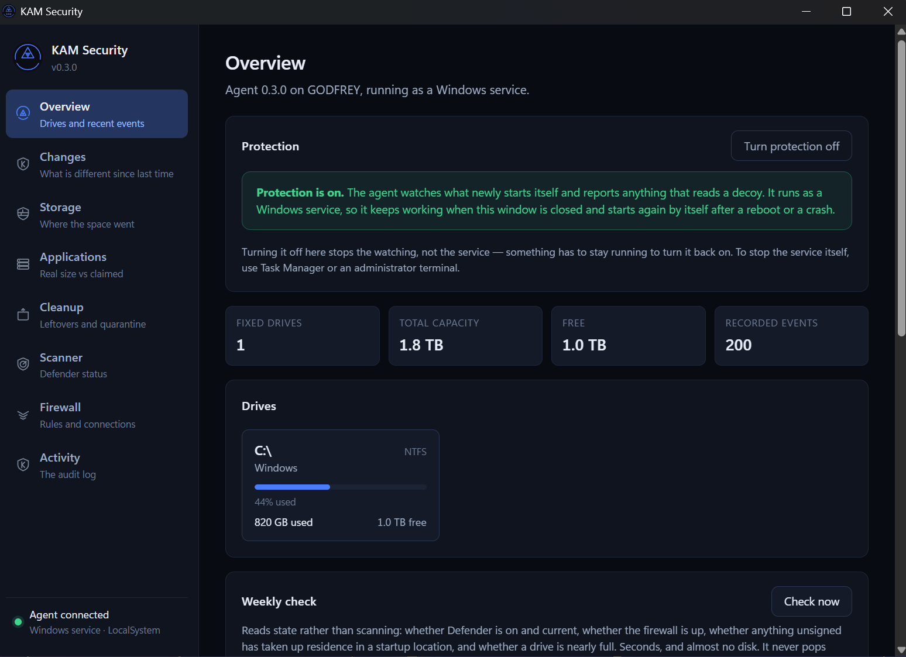
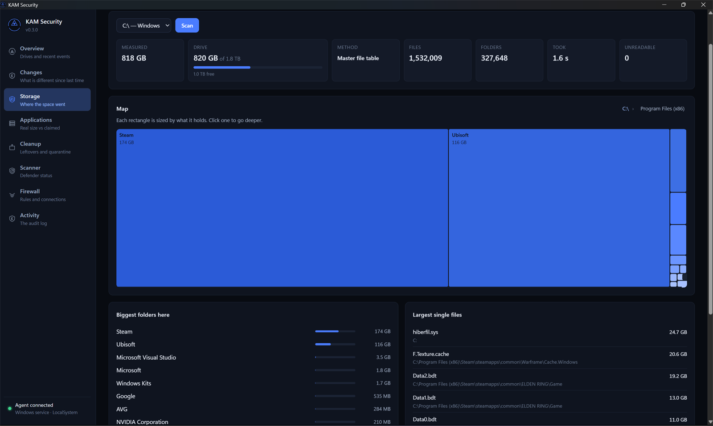
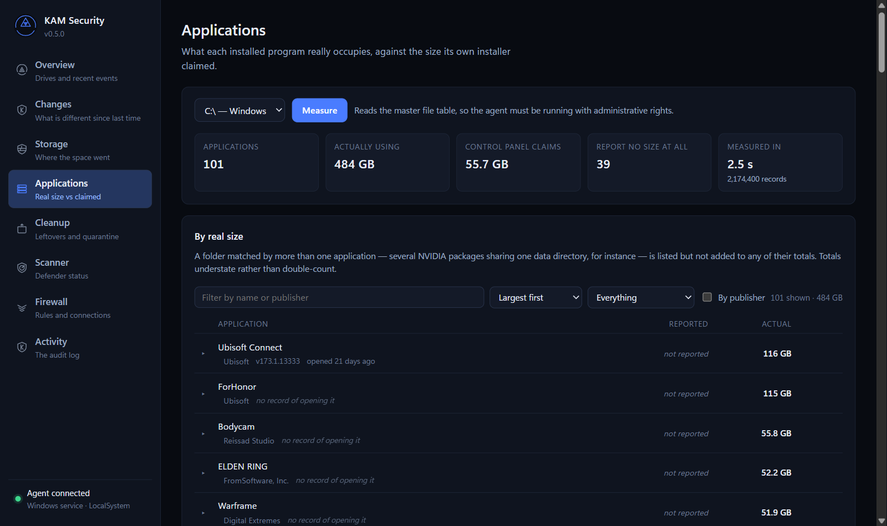
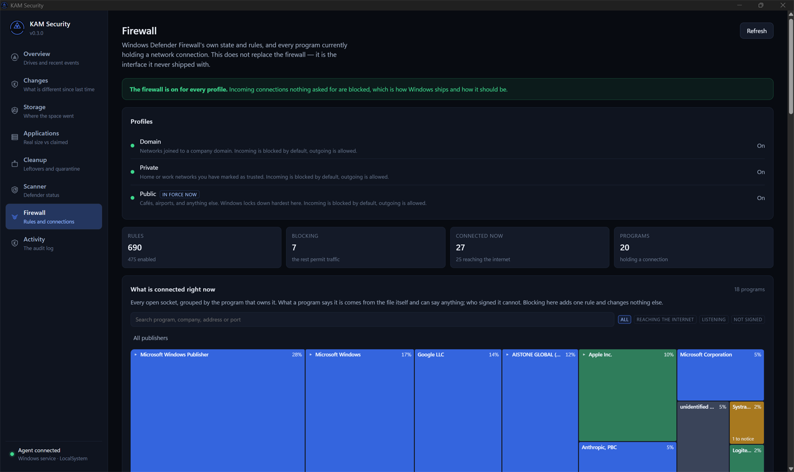
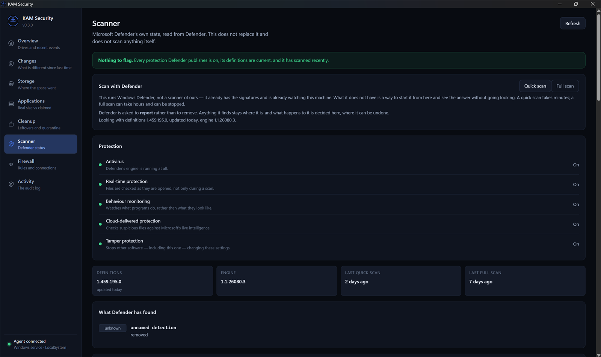
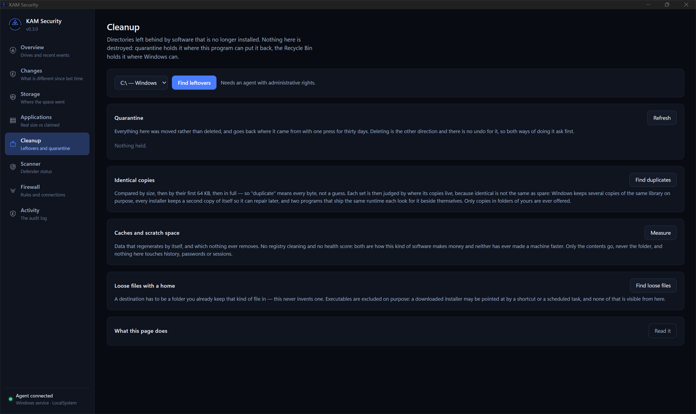
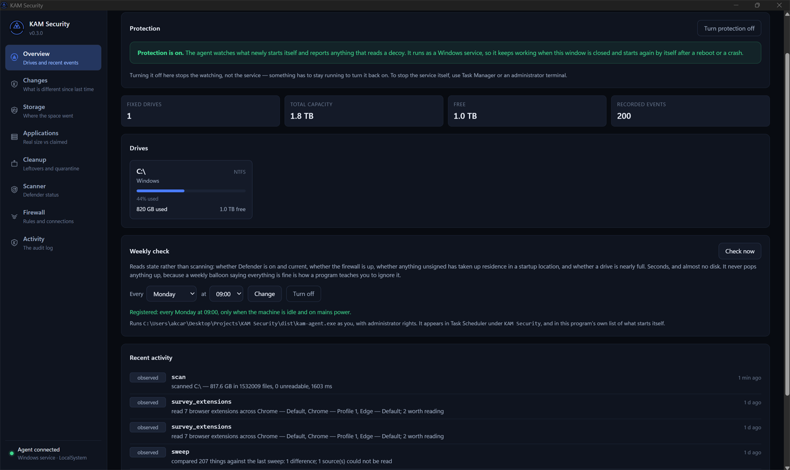

<p align="center">
  
</p>

<h1 align="center">KAM Security</h1>

<p align="center">
  A control plane for Windows' built-in security, and a storage engine that
  answers questions Windows already knows but never surfaces.
</p>

<p align="center">
  <a href="https://github.com/Ari-Joon/KAM-Security/actions/workflows/ci.yml">
    
  </a>
  
  
  
</p>

---

Windows ships an excellent antivirus engine and a capable firewall. What it does
not ship is a usable interface to either, or any way to find out where your disk
space went. Consumer suites fill that gap with subscription nagware.

KAM Security is the alternative: one Rust application that drives Microsoft
Defender, manages Defender Firewall, and adds two things nothing else does.

**Real storage attribution.** Control Panel's size column is `EstimatedSize`, a
number the installer writes about itself. It is routinely wrong and never counts
anything outside the install directory.

**Provenance-based judgement.** Rather than asking "does this file match a known
threat" (Defender already does that better), ask what an analyst would: who
signed it and does Windows still accept that signature, when did it arrive,
where was it downloaded from, and how does it survive a reboot. None of those
answers means anything alone. Together they sort several hundred executables
into the two or three actually worth reading about, with the reasoning attached.

It is not a detector and does not claim to be. The evidence is circumstantial by
construction, so nothing in that layer deletes, blocks or quarantines anything.
Presenting circumstantial evidence as a verdict is the whole business model of
the software this replaces.

<p align="center">
  
</p>

<table>
  <tr>
    <td width="50%"></td>
    <td width="50%"></td>
  </tr>
  <tr>
    <td><b>Storage:</b> a whole drive read from the master file table in under two seconds, drawn to scale.</td>
    <td><b>Applications:</b> what each program really occupies, against what its installer claimed.</td>
  </tr>
  <tr>
    <td></td>
    <td></td>
  </tr>
  <tr>
    <td><b>Firewall:</b> every open socket, grouped by who signed the program holding it.</td>
    <td><b>Scanner:</b> Defender's real state, and the same scan as Windows Security, started from here.</td>
  </tr>
  <tr>
    <td></td>
    <td></td>
  </tr>
  <tr>
    <td><b>Cleanup:</b> quarantine for thirty days, or the Recycle Bin. Deleting for good is a separate step.</td>
    <td><b>Weekly check and audit log:</b> state read in seconds, and every action written down.</td>
  </tr>
</table>

## Reading a terabyte in two seconds

The storage view reads the NTFS master file table directly instead of walking
directories, which is the difference between a coffee break and an eyeblink.

Measured on a 1 TB system drive holding 1.4 million files:

| | Master file table | Directory walk |
|---|---|---|
| First scan after a reboot | **2.4 s** | 57.8 s |
| Repeat scan, warm cache | **2.4 s** | 15.2 s |
| Agreement with the 1036.3 GB Windows reports | **99.6%** | 97.6% |
| Needs administrator rights | yes | no |

The table read was later measured properly rather than assumed, on a 1.8 TB
drive whose table holds **1,912,577 records**. Almost none of the time was the
disk:

| | Before | After |
|---|---|---|
| Reading the table | 2356 ms | **1204 ms** |
| Of that, waiting on the disk | 588 ms | 549 ms |
| Of that, interpreting records | 1768 ms | **655 ms** |
| Building the directory tree | 344 ms | 319 ms |
| Measuring every application | 194 ms | 108 ms |
| **Whole survey** | **2937 ms** | **1668 ms** |

Two gigabytes of records came off an NVMe disk in half a second and took nearly
two to interpret, one at a time, while the disk sat idle. The framing stays on
the reading thread, because a data run can end mid-record and deciding where
records begin has to happen in order; the interpreting moved to a pool of
parsers behind a short queue. Identical output either way, down to the record
count.

The window shows what the measurement cost, with the per-stage breakdown behind
the tooltip. "It feels slow" is not something anybody can act on.

Both figures are given because the walk gains hugely from a warm filesystem
cache while the table barely notices one: it is a single sequential read either
way. Six times faster is the fair claim; twenty-four times is what you see on
the first scan after a reboot.

The walk is slower *and* less accurate: it cannot open every directory, and it
counts a hard-linked file once per link, which on a Windows volume means
counting much of `WinSxS` several times. Both paths produce the same result
type, and the app falls back automatically when it cannot read the table, saying
so rather than quietly taking a minute.

Getting the fast path right needed two things the documentation does not put
front and centre: fragmented files spill their attributes into **extension
records**, and only the `$DATA` fragment starting at **virtual cluster 0** knows
the file's real length. Missing either reports a 138 GB archive as 0 bytes.
Between them they accounted for 270 GB on the test volume.

### The list arrives before the sizes

What an installer *claims* about itself is a registry read: every name,
publisher, version, install date and claimed size, in about a fifth of a second,
needing no privileges at all. What it *occupies* needs the whole file table.

So the list appears immediately and can be searched, sorted and grouped straight
away; only the size column waits, and it shows a waiting mark rather than a zero,
because a zero in that column is a claim and it would be wrong for every row on
screen.

## What this is not

- **Not a new antivirus engine.** It orchestrates Defender rather than competing
  with it. Two real-time engines make a machine slower and less safe.
- **Not a real-time file interceptor.** That needs a kernel minifilter driver,
  an EV certificate, Microsoft attestation signing and Virus Initiative
  membership. Permanently out of scope.
- **Not a registry cleaner.** No measurable benefit, real breakage risk.
- **Not a WFP replacement.** The Windows Filtering Platform *is* the network
  stack's filter layer. KAM manages its ruleset; it does not displace it.

## Design rules

1. Reversible first. Cleanup moves things to a thirty-day quarantine or to the
   Recycle Bin. Deleting for good is a separate step you ask for, and clearing
   a cache that costs something says what it costs first.
2. No scareware. No inflated issue counts, no alarming defaults.
3. Every privileged action is written to an audit log the user can read, and the
   database rejects updates and deletes so it cannot be quietly rewritten.
4. Every finding shows the evidence that produced it.
5. The service never makes a change you could not make yourself. Anything that
   affects the whole machine goes through Windows' own permission prompt.

## Architecture

```
┌─ kam-shell: Tauri window, ordinary user rights ──┐
│  React UI · treemap · no privileges              │
└───────────────────────┬──────────────────────────┘
                        │  named pipe, protected DACL,
                        │  length-prefixed JSON
┌───────────────────────▼──────────────────────────┐
│  kam-agent: Windows service, LocalSystem         │
│  scanner · firewall · storage · quarantine       │
└──────────────────────────────────────────────────┘
```

The UI is a browser engine, and a browser engine must never run as SYSTEM. The
pipe carries a protected DACL, rejects remote clients, and the agent resolves
each caller's executable: being allowed to open the pipe is not the same as
being trusted to drive it.

Being trusted to drive it is not the same as being allowed to change the whole
machine, either. Defender's protections, audit policy, firewall rules, the
protection switch, and clearing a cache outside your own profile all need a
caller Windows has elevated, read from the caller's own token before any
handler runs. The window never runs elevated. It asks with the ordinary Windows
permission prompt, and an approved copy makes that one change and exits.

See [PLAN.md](PLAN.md) for the full design and phase breakdown.

## Status

Phases 0 to 4 are complete and phase 5 is in progress. Nothing claims to be
finished software.

| Phase | Scope | State |
|---|---|---|
| 0 | Workspace, CI, tooling | Done |
| 1 | Agent, IPC, audit log, shell | Done |
| 2 | Storage intelligence | Done |
| 3 | Scanner | Done, plus a behaviour watcher, canary files, a browser extension inventory and a Defender hardening report |
| 4 | Firewall | Rules, connections and one-click block done; ETW watcher deliberately deferred |
| 5 | Installer, scheduler, polish | Setup script, scheduler, cleaning, tray icon and update check done; **no signed installer** |

The honest gap: there is no signed installer. A release is a zip with a setup
script, and SmartScreen warns about it on first run (see
[A note on antivirus warnings](#a-note-on-antivirus-warnings)).

Phase 2 covers: the master file table reader, a zoomable treemap, true
application footprint across every location an app touches, uninstalling from
within the app, orphan detection for software uninstalled long ago, download
provenance from the `Zone.Identifier` stream, byte-for-byte duplicate detection,
and proposals for filing loose downloads into folders you already keep.

Phase 3 so far covers: Defender's real state read from Defender rather than from
the Settings app, and the provenance engine: Authenticode verification against
both embedded signatures and the system catalogues, arrival times, download
origin, and every place a program anchors itself to survive a reboot (Run keys
in both hives and both registry views, services, scheduled tasks and the Startup
folders). Sources it could not read are reported rather than silently omitted.

Scans are Defender's own. A quick or full scan started here is the same scan as
the button in Windows Security, so Defender deals with what it finds the way it
is set up to, usually by quarantining it where Windows Security can restore it.
When the scan ends, KAM lists what Defender recorded, by name, and a history it
could not read is shown as unread rather than as a clean result. Defender's own
switches (cloud protection, blocking of potentially unwanted apps, the attack
surface reduction rules) are read from where Defender keeps them, including
audit mode and settings an organisation's policy controls.

It also matches YARA rules against those same executables. They are aimed not
at malware, which Defender handles, but at the grey band Defender deliberately
tolerates:
bundled adware installers, scareware optimisers, browser hijackers, miners, and
the fetch-and-run patterns that only exist as text. Rules carry their own
plain-English explanation, and you can drop your own `.yar` files into
`%ProgramData%\KAM Security\rules` to have them matched alongside.

Three of those rules exist because of a specific infection, described under
[Watching what starts itself](#watching-what-starts-itself) below: one for
browser credential theft (the exact on-disk names of the password, cookie and
key stores a stealer reads), one for a build tool used as a loader (an MSBuild
project file carrying inline code that reflectively loads a payload), and the
provenance engine learned to judge what a launcher is *told* to run rather than
the launcher itself.

The rule engine runs in the **unprivileged shell**, not in the LocalSystem
agent. `yara-x` compiles rules to WebAssembly and executes them through a JIT,
which does not belong inside the most privileged process in a security product.
That split works because privilege is needed to *find* the interesting
executables (services, scheduled tasks, both registry hives) but not to read
them. The agent finds; the shell matches. A test in the agent fails the build if
the rule engine ever creeps back across that line.

With a free VirusTotal API key you can also ask about an individual file. Only
the file's SHA-256 is sent; the file itself is never uploaded, and there is no
code in the project that could upload it. Every lookup is one deliberate click
on one file. Nothing runs in bulk or in the background, because telling a third
party which files sit on your machine is a decision to make each time rather
than a behaviour to discover. The key is yours, stored encrypted under your
Windows account with DPAPI, and none ships with the product.

Long jobs (the provenance survey and duplicate detection) report what they
are doing as they do it, and can be stopped. A scan behind a disabled button is
indistinguishable from one that has hung, and people reasonably assume the
second. The agent streams named stages and counts down the same pipe that
carries the result, and a second connection carries the request to stop.

Results are reported as "N of M engines", never as a bare count. A handful of
detections against a large majority is the everyday signature of a false
positive, and the interface says so in as many words rather than colouring it
red.

## Cleaning, and what it refuses to do

There is no registry cleaner and no health score. Both are how this category of
software makes money and neither has ever made a machine faster.

What is here is the small real list: temporary files, update downloads, crash
dumps, error reports, thumbnails, shader caches, browser caches, developer
package caches, Steam scratch, and a previous Windows that never removed itself.
On the machine this was written on that came to **72.6 GB**, of which 51.9 GB
was one graphics shader cache whose own size limit was plainly not working. Each
entry says what it holds and what clearing it costs, and the ones that cost
something say so rather than being presented as free.

Prefetch is deliberately absent: clearing it is folklore, and it makes the next
launch of everything slower for a few megabytes. The component store is left
alone too: it looks enormous and is mostly hard links to files in use.

Clearing runs in the agent, so the interface names an **id** from a compiled-in
catalogue and never a path. There is no request shape that carries a directory
to empty, because there is no version of that which is safe in a LocalSystem
process. Only contents go, never the folder; a junction is removed as a link
rather than followed, because a junction inside a cache pointing at your
documents would otherwise mean emptying the cache emptied the documents.

### Duplicates that are not waste

Identical is not the same as spare. Windows keeps several copies of the same
library on purpose, every installer keeps a second copy of itself so it can
repair later, and two programs shipping the same runtime each look for it beside
themselves. A list calling all of that "wasted" is a list that gets somebody to
break their own machine.

So every copy is judged by where it lives, and there are two numbers rather than
one, *duplicated* and *reclaimable*, which are usually very different. Only a
copy in a folder you own is ever offered, anything it cannot attribute is shown
without a recommendation, and removing one goes through quarantine like
everything else.

## The firewall

Windows Defender Firewall works. What it lacks is a way to see what it has been
told to do, and what is happening now. KAM Security shows both: profile state
and all several hundred rules, and every open socket joined to the program that
owns it and to whoever signed that program. `netstat -b` gets closest to the
second and tells you nothing about signing; Resource Monitor shows names without
paths. "chrome.exe is connected to 142.250.x.x" is not useful; "an unsigned
program in your AppData folder is connected to the internet" is.

Blocking a program adds exactly one outbound rule, on every profile, tagged with
a group of our own. That tag is what makes removal safe: this product will only
delete rules carrying it, so a rule Windows or an installer created cannot be
removed here even by mistake, and there is a test asserting it refuses to touch
Windows' own "Core Networking" rules. Existing rules are read and shown, never
edited. Blocking asks first and says exactly what it will do.

Everything else the plan listed for the firewall (prompting *before* a
connection opens) is permanently out of scope. It needs a kernel driver, an EV
certificate and Microsoft attestation signing.

## What changed since last time

Every other view reports what is true now. **Changes** reports what is
different: services, Run keys, Startup items, scheduled tasks and local
administrators, compared against a baseline and charted over twelve weeks.
There is no score, because a score needs an idea of what a correct machine
looks like, and this software does not have one.

Things disappearing count at least as much as things appearing. An antivirus
service or a backup task quietly removed is reported, and Windows reports that
nowhere else. It also notices when an entry's path stays the same but the file
behind it is now signed by someone else, or by nobody. Changes this program
made itself are labelled rather than hidden, so malware cannot hide by using
its name.

## Watching what starts itself

Everything above judges the machine at rest, when someone opens the window and
asks. That is the wrong shape for one kind of threat, and this section exists
because of a real one.

A machine this tool runs on was infected by an infostealer, downloaded inside a
file pretending to be a game update. It ran for about three minutes, copied the
browser's saved passwords and login cookies, and left behind a **hidden
scheduled task** that re-launched itself at every sign-in by handing a project
file to **MSBuild**, a Microsoft-signed build tool that antivirus trusts and
whose project files it does not read. Windows Defender never flagged any of it.
A full offline Defender scan eventually removed one dropped file; the task, the
launcher and the second-stage payload sat untouched until they were taken apart
by hand.

Two things in that story are the point. The malware ran while nobody was
looking, and it survived by wearing a trusted program's face. So the agent now
does one thing without being asked: every couple of minutes it takes the same
cheap snapshot the weekly check does (the Run keys, the Startup folders, the
services, the task store), and anything that has newly appeared in the shape
unwanted software uses to run unseen is written to the audit log and shown in
**Scanner → What has started itself lately**, with the evidence attached. The
shapes it knows are the ones that infection used:

- a launcher (`cmd.exe`, `PowerShell`, `MSBuild`, `rundll32`) told to run a
  script or project from a folder any program can write to
- a scheduled task marked **hidden**, so it never shows in Task Scheduler
- a new sign-in or Startup entry pointing at an unsigned script in AppData or
  Temp
- an unsigned installer run from Temp claiming a hardware vendor whose real
  installers are always signed

It never stops, deletes or blocks anything. Killing a process a second late is
theatre, and acting automatically on circumstantial evidence is the behaviour
this whole product is an alternative to. What it does is make sure a person can
see it within the minute rather than after a day, which is the only thing that
was actually missing the first time.

This is honest about its cost. The rest of the agent makes a point of no
measurable CPU while idle; the watcher spends a little of that on one registry
read a couple of times a minute. That trade is written down here rather than
hidden, and the snapshot is deliberately not a scan.

## Files that exist only to be stolen

Everything above weighs circumstantial evidence, and says so. This does not.

A canary is a file with no legitimate reason to be touched: a fake saved-password
database, a fake wallet, a fake recovery phrase. Nothing on the machine uses
them, no backup job wants them, and nothing but this program knows they exist. So
if something reads one, there is no innocent explanation to weigh against: it is
close to proof that a program is going through your files looking for
credentials. The idea is borrowed from [canarytokens.org](https://canarytokens.org),
which does it with documents that phone home; this does it locally, so nothing
ever leaves the machine.

It works through Windows' own auditing. Each decoy gets a **SACL** asking for an
event whenever anyone reads it, and Windows then records event 4663 in the
Security log naming the file, **the process that read it**, and the account. No
driver, no hooking, no third party, no network. The answer is not "something read
your documents" but "this program, at this time, as this user", which is the
difference between knowing you were robbed and knowing who did it.

Switching on file auditing changes a Windows setting, so this is opt-in twice
over: planting decoys only writes files, and switching on auditing is a
separate, reversible action that says exactly what it does and goes through
Windows' permission prompt. It is narrower than it sounds: the subcategory only
produces events for objects
carrying a SACL, and almost nothing on a normal machine does, so five decoys do
not make a noisy Security log.

### Always on, and one switch to stop it

The agent is a Windows service: automatic start, LocalSystem, and set to restart
itself 5 seconds, 15 seconds and 60 seconds after a crash. Closing the window
does not stop it, and neither does signing out. There is nothing to remember to
launch.

It can be stopped in exactly two places. **Overview → Protection** has a switch,
and turning it off stops the watching within a few seconds. Turning it off or on
raises Windows' own permission prompt, the same consent Windows Security asks
for, so nothing running on the machine can switch it off without you agreeing.
That does *not* stop
the service, on purpose twice over: something has to remain running to switch it
back on, and a security tool that can be silenced through its own interface is
one an attacker silences. Stopping the service itself takes Task Manager or an
administrator, which is a deliberate act by somebody already in charge of the
machine.

The same switch is available headlessly. Reading it needs nobody special;
changing it needs an administrator terminal, for the same reason:

```
kam-agent.exe --protection
kam-agent.exe --protection-off
kam-agent.exe --protection-on
```

The setting is remembered across restarts, and a store that has never been
written, or cannot be read, reads as *on*. Failing closed is the wrong default
for a light switch and the right one for this.

The window is separate from all of this. The first time KAM Security runs, it
adds itself to your sign-in items so its icon sits by the clock from then on,
with no window until you open one. It says so on the Overview, beside the
checkbox that turns it off. Closing the window leaves the icon, and the tray's
**Close the icon (protection keeps running)** does exactly what it says: the
service carries on either way.

### The registry gets decoys too

Documents are only half of where a thief looks. Several programs people rely on
keep connection details in the registry under well-known paths: PuTTY stores
every saved session with its hostname and username, WinSCP stores its sessions
with a reversibly-encrypted password beside them, and the Remote Desktop client
records the machines you have connected to and the account you used. All of it is
enumerated by stealers, because it maps out what else of yours is reachable.

So there are decoy sessions there as well, watched the same way. Two details
differ and both are handled: registry auditing is a **separate subcategory** from
file auditing, so switching canaries on switches both (a decoy that produced no
events because only half the policy was set would look like an all-clear), and
Windows names a registry object in the kernel's own namespace
(`\REGISTRY\USER\<sid>\…`) rather than the form anyone types, so the event
matching accounts for that.

A decoy session is a subkey alongside any real ones, never a value inside
somebody's own session, and each is named `KAM-Security-decoy-do-not-use` so that
a person who finds one in their own PuTTY list can tell at a glance it is not
theirs. A stealer enumerates every session under those paths rather than opening
one by name, so a decoy does not need to deceive anybody to be found.

**This half is switched off, and the reason is worth reading.** On the machine it
was built on, the agent creates the keys and every check it makes agrees they are
there: the create call succeeds, the key reopens, the marker value reads back,
and the kernel writes audit events for successful opens of those exact paths.
Nothing else on the machine can see them. `reg.exe`, `Test-Path` and .NET's
`OpenSubKey` all report the leaf missing, and `OpenSubKey` returns null rather
than throwing, so it is genuinely "not found" rather than a permissions problem.

The cause is not understood. The consequence is: if the account's own tools
cannot see the key, an infostealer running as that account cannot see it either,
so the decoy would never be read. A canary that is never read is not protection.
It is a line in the interface claiming protection that does not exist, which is
worse than the feature being absent, because it stops somebody looking further.
So planting is held behind one flag while the disappearing keys are explained.
The file canaries above are unaffected and verified working.

The rules it holds itself to are worth stating, because the decoy paths are
deliberately chosen to look like things people really keep:

- **Nothing is ever overwritten.** A decoy is only created where no file exists.
- **Nothing is planted inside another program's data**, so a canary cannot
  confuse a browser, a wallet, or the tools that read your real `.ssh` folder.
- **Nothing is deleted that this program did not write.** Removal reads a marker
  inside the file first and refuses anything without it.
- **The contents are worthless.** Every decoy says inside what it is, so nobody
  is misled by their own file and an attacker who takes one gains nothing.

## Running it

Prebuilt binaries are on the [releases page](https://github.com/Ari-Joon/KAM-Security/releases).
Unzip anywhere and **keep every file in the same folder**, because the agent only
serves clients installed alongside it. Then right-click `setup.ps1` and choose
**Run with PowerShell**, or from a terminal:

```
powershell -ExecutionPolicy Bypass -File setup.ps1
```

It asks for administrator rights once, locks the folder so only administrators
can change what is in it, registers the service that makes the fast disk scan
possible, and puts a shortcut on your desktop. `setup.ps1 -Remove` undoes those
things. The sign-in entry belongs to the app rather than the script, so untick
**Start KAM Security when I sign in** on the Overview first if you are removing
it for good.

You can skip the script and just run `kam-shell.exe`. The app still works, and
the disk scan falls back to walking directories, which is slower.

To upgrade, run `setup.ps1 -Remove` from the old folder, then set up the new
release the same way. Quarantined items and the audit log are kept.

To build from source, see [docs/SETUP.md](docs/SETUP.md).

### Updates

Once a day, and whenever you press **Check now** on the Overview, KAM Security
asks GitHub's public API for the newest release and compares it with its own
version. If there is a newer one, it shows the version, the date and the notes,
and a button that opens the release page. It sends nothing about the machine,
and the daily check can be switched off.

It never downloads or installs anything itself. The service runs as
LocalSystem, so anything an updater installed would run with the highest
privilege Windows has, and doing that automatically needs signed releases
first. A check that fails says it could not tell. It never says you are up to
date when it does not know.

## A note on antivirus warnings

This application enumerates every file on disk, reads raw volumes, runs an
elevated service and edits firewall rules: the same behaviours malware
exhibits. Releases are unsigned, so SmartScreen will warn on first run and some
scanners may flag the binaries.

That is the honest cost of the category. The source is published in full, the
binaries are never packed or obfuscated, and every release ships a SHA-256
checksum. Building it yourself is the strongest guarantee available, and takes
one command.

Staying unsigned is a decision rather than an oversight, and it is recorded as
one in [PLAN.md](PLAN.md). It has a consequence worth stating: this product's
own weekly check reports **its own agent** as carrying no signature, by name,
alongside anything else on the machine that does. A program that reports on what
starts itself and then quietly omits its own entry would not be worth trusting
about anything else.

## Contributing

See [CONTRIBUTING.md](CONTRIBUTING.md), which includes the list of things that
are permanently out of scope, worth reading before writing anything large.

Security issues go through [SECURITY.md](SECURITY.md), privately. Never a public
issue: the agent runs as LocalSystem.

## Licence

[Apache-2.0](LICENSE). Dependencies are held to permissive licences by
`cargo deny`, which is what keeps a copyleft library from quietly making the
whole project GPL.
